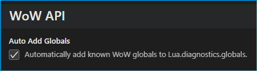

# Change Log

## [0.15.7] - 2024-08-08
- 0.15.7 Forgot to actually use `$USERPROFILE`
- Changed `Lua.workspace.library` to use the `$USERPROFILE` env variable instead of an absolute path

## [0.15.5] - 2024-08-07
- ✨ Improved support for loading FrameXML mirrors by disabling most diagnostic warnings
- Added an option to enable/disable the extension when loading a FrameXML mirror

## [0.15.4] - 2024-08-06
- 0.15.4: 📦 Fix vscodeignore for vscode packager 
- 0.15.3: Updated flavor data for hover tooltip; "mainline" now refers to TWW
- 0.15.2: 🐞 Fixed `:CreateAnimation` generic
- ✨ The extension now only loads if a World of Warcraft addon is detected in the workspace
- 👻 Added [GlobalColors.lua](https://www.townlong-yak.com/framexml/live/Helix/GlobalColors.lua) from Townlong Yak
- PR [#154](https://github.com/Ketho/vscode-wow-api/pull/154) Updated definition for Ace3 OptionsTable, `args` to be an optional

### Workspace detection
To avoid loading for Lua projects not related to World of Warcraft, all settings will be specific to the workspace instead of the global user settings; and this extension will only activate when either:
- the extension was previously loaded in the workspace.
    - *details: a `settings.json` with `Lua.workspace.library` containing a path with the substring `wow-api` exists in the workspace.*
- a [.toc](https://warcraft.wiki.gg/wiki/TOC_format) file exists.
    - *details: a `.toc` file with the `## Interface:` directive exists in the workspace.*
- the "Activate WoW API extension" command is used.

## [0.15.0] - 2024-08-02
- 🎉 Updated for patch 11.0.2 (55763)
- ✨ The Lua API now more closely resembles the WoW environment
- 📝 API functions are marked if they have invalid or missing documentation from the wiki
- ❗ Notice: moved `EmmyLua` folder to [Annotations](https://github.com/Ketho/vscode-wow-api/tree/master/Annotations), for users with other IDEs
- 🛠 Code refactoring
- 🐞 Fixed `:CreateAnimation` inject-field warning
- 🐞 Fixed deprecated APIs not showing the deprecated warning
- Deprecated APIs will be kept around until patch 11.1.0

## [0.14.2] - 2024-07-18
- Fixed `inject-field` warning when defining fields on Frames
- Readded completion for `UnitId` type

## [0.14.1] - 2024-06-09
- Fixed [#146](https://github.com/Ketho/vscode-wow-api/issues/146) FontString:SetFormattedText is claimed to not accept vararg

## [0.14.0] - 2024-05-28
- 🎉 Update to patch 10.2.7 (54847)
- Fixed [#145](https://github.com/Ketho/vscode-wow-api/issues/145) Updated annotations of some Ace3 libraries
- Fixed [#144](https://github.com/Ketho/vscode-wow-api/issues/144) EditMacro icon param typings
- ✨ Feature: Shows for which flavors API functions exist in the tooltip

&nbsp; &nbsp; &nbsp; 

## [0.13.6] - 2024-04-24
- PR [#140](https://github.com/Ketho/vscode-wow-api/pull/140) Define `WOW_PROJECT_CATACLYSM_CLASSIC`
- PR [#139](https://github.com/Ketho/vscode-wow-api/pull/139) Add option `autoAddGlobals`

&nbsp; &nbsp; &nbsp; 

- PR [#138](https://github.com/Ketho/vscode-wow-api/pull/138) fix arguments of `GetCategoryNumAchievements`
- Updated `:SetFont` to use `FontFile|string` types.

&nbsp; &nbsp; &nbsp; 

- Updated `:SetFontObject` to use `FontObject|string` types. Completion only works as a string type but it also accepts (global) Font objects, so both `GameFontNormal` and `"GameFontNormal"` are valid.

&nbsp; &nbsp; &nbsp; 

## [0.13.5] - 2024-03-25
- Fixed Blizzard_Deprecated annotations for UnitAura and similar

## [0.13.4] - 2024-03-24
- 🎉 Update to patch 10.2.6 (53877)
- 🌙 Added latest Blizzard_Deprecated additions
- 🛠 Improvements: Enums are now properly shown in code completion

&nbsp; &nbsp; &nbsp; 

## [0.13.3] - 2024-03-01
- Added `Frame:LockHighlight`, `:UnlockHighlight`
- Added `GameTooltip:SetUnitDebuffByAuraInstanceID`
- Fixed `C_PetJournal.SetPetSortParameter`
- Fixed `FontString:SetFont` optional flags
- 🛠 Improvements: Shows if a cvar is secure

## [0.13.2] - 2024-01-23
- Fixed ScriptRegionResizing:SetPoint `relativeTo` param when using templates
- Fixed Frame:SetAttribute `value` param
- Fixed FontObject params
- Fixed ModelAsset type

## [0.13.1] - 2024-01-18
- 🎉 Update to patch 10.2.5 (52902)
- 🐞 Fixed `param-type-mismatch` diagnostic for BackdropTemplate
- Added FlipBook and VertexColor animation widgets
- Marked LibDataBroker optional dataobject fields
- Update CopyTable `shallow` param from patch 9.1.0
- Update UnmuteSoundFile param
- Fixed [#125](https://github.com/Ketho/vscode-wow-api/issues/125) SetNormalFontObject param-type-mismatch
- Fixed [#122](https://github.com/Ketho/vscode-wow-api/issues/122) C_NamePlate.GetNamePlates is missing return type
- PR [#123](https://github.com/Ketho/vscode-wow-api/pull/123) Make childGroups optional in AceConfig.OptionsTable
- PR [#120](https://github.com/Ketho/vscode-wow-api/pull/120) Add definition for tostringall()

[0.15.7]: https://github.com/Ketho/vscode-wow-api/releases/tag/0.15.7
[0.15.6]: https://github.com/Ketho/vscode-wow-api/releases/tag/0.15.6
[0.15.5]: https://github.com/Ketho/vscode-wow-api/releases/tag/0.15.5
[0.15.4]: https://github.com/Ketho/vscode-wow-api/releases/tag/0.15.4
[0.15.3]: https://github.com/Ketho/vscode-wow-api/releases/tag/0.15.3
[0.15.2]: https://github.com/Ketho/vscode-wow-api/releases/tag/0.15.2
[0.15.1]: https://github.com/Ketho/vscode-wow-api/releases/tag/0.15.1
[0.15.0]: https://github.com/Ketho/vscode-wow-api/releases/tag/0.15.0
[0.14.2]: https://github.com/Ketho/vscode-wow-api/releases/tag/0.14.2
[0.14.1]: https://github.com/Ketho/vscode-wow-api/releases/tag/0.14.1
[0.14.0]: https://github.com/Ketho/vscode-wow-api/releases/tag/0.14.0
[0.13.6]: https://github.com/Ketho/vscode-wow-api/releases/tag/0.13.6
[0.13.5]: https://github.com/Ketho/vscode-wow-api/releases/tag/0.13.5
[0.13.4]: https://github.com/Ketho/vscode-wow-api/releases/tag/0.13.4
[0.13.3]: https://github.com/Ketho/vscode-wow-api/releases/tag/0.13.3
[0.13.2]: https://github.com/Ketho/vscode-wow-api/releases/tag/0.13.2
[0.13.1]: https://github.com/Ketho/vscode-wow-api/releases/tag/0.13.1
