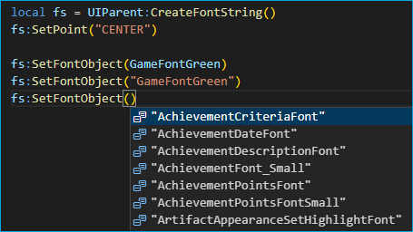

# Change Log

## [0.21.0] - 2025-08-17
- ✨ Updated annotations for patch 11.2.0
- ✨ Updated Game Type tooltip data for 5.5.0 (MoP Classic)
- 🛠 Refactoring and rewriting of lua scripts

## [0.20.8] - 2025-06-16
- 🐞 Cleaned up old code for removing `type.weakUnionCheck` option and any empty settings.json file.

## [0.20.7] - 2025-05-30
- ✨ Updated (FrameXML) annotations for PTR 11.1.7 (61048)
- 🐞 Define ItemLocation/PlayerLocation mixin methods optional when passing its minimal object

## [0.20.6] - 2025-04-18
- 📦 Fixed [#193](https://github.com/Ketho/vscode-wow-api/issues/193) Forgot to checkout submodules in the github action for publishing releases

## [0.20.5] - 2025-04-17
- ⚙️ The User settings will now only be migrated/cleaned up *while* changing the configuration scope option from User to Workspace, instead of every single time on startup. This allows users more freedom to use both configuration scopes.

## [0.20.4] - 2025-04-17
- ⚙️ The manual/custom [FrameXML](https://github.com/Ketho/vscode-wow-api/tree/master/Annotations/Core/FrameXML) annotations are now always loaded regardless of the load FrameXML option

## [0.20.3] - 2025-04-16
- [Numy/FrameXML](https://github.com/NumyAddon/FramexmlAnnotations) update (requires enabling the FrameXML option)
- All frame names should now be wrapped in _G if they contain characters forbidden in variable names
- KeyValues are handled correctly (global lookups are wrapped in _G when needed; Enum.Foo lookups are supported correctly)
- Bug that caused only the first KeyValues to be processed has been fixed, and overwriting inherited KeyValues is properly supported
- Generated class names for child frames now default to a frame's global name (if any), and should generally be shorter with less repetition in the name
- Type inheritance now properly normalizes the class name (fixes things like `@class Foo: Some-WeirdTemplate`)

## [0.20.2] - 2025-04-16
- 🐞 Fixed [#189](https://github.com/Ketho/vscode-wow-api/issues/189) `MessageFrame:AddMessage()` optional params are set mandatory
- ✨ Updated wiki and generated FrameXML annotations
- ⚙️ Now only filters paths with `ketho.wow-api` instead of `wow-api` from luals library path
- ⚙️ Moved `Lua` and `Libraries` into the `Core` folder
- Disables the `assign-type-mismatch` diagnostic but only when manually annotating UI objects with `@type`

## [0.20.1] - 2025-04-12
- 🐞 Fixed [#187](https://github.com/Ketho/vscode-wow-api/issues/187) Improper LuaLS return typings for variable returns from BlizzardAPIDocs 
- 🐞 The `type.weakUnionCheck` option is now only enabled when needed

## [0.20.0] - 2025-04-11
- ✨ The FrameXML option now loads annotated FrameXML source code but is disabled by default
- 🐞 Fixed [#186](https://github.com/Ketho/vscode-wow-api/issues/186) Empty .vscode folder being created since 0.19.0
- 🐞 Fixed [#185](https://github.com/Ketho/vscode-wow-api/issues/185) Prevent `param-type-mismatch` warning for templates by enabling `type.weakUnionCheck` option
- 🐞 Fixed [#184](https://github.com/Ketho/vscode-wow-api/issues/184) Support activating outside of (addon) workspaces
- ⚙️ Updated vanilla 1.15.7 flavor data

## [0.19.1] - 2025-04-02
- 🐞 No longer purges any custom paths from User scope `Lua.workspace.library` if the scope is set to Workspace

## [0.19.0] - 2025-04-02
- 🎉 Updated for PTR patch 11.1.5 (60008)
- ✨ Added an option (enabled) for loading [NumyAddon/FramexmlAnnotations](https://github.com/NumyAddon/FramexmlAnnotations), this however increases loading time by roughly 4 to 6 seconds
- ✨ Expanded support for templates but only the most [popular](https://github.com/Ketho/vscode-wow-api/blob/master/Annotations/Core/Widget/UIType/Template.lua) ones are supported due to performance issues
- 🐞 Fixed [#180](https://github.com/Ketho/vscode-wow-api/issues/180) - Workspace settings were not cleaned up while using User settings
- ⚙️ Added [Dev Mode](https://github.com/Ketho/vscode-wow-api/wiki/Settings#dev-mode) option for manually setting the LuaLS configuration
- 🧹 Blizzard_Deprecated: Removed 10.x and added up to 11.1.5

## [0.18.2] - 2025-01-03
- 🎉 Updated for patch 11.0.7 (58238)

## [0.18.1] - 2024-12-16
- [#174](https://github.com/Ketho/vscode-wow-api/issues/174) Added ItemRefTooltip

## [0.18.0] - 2024-12-10
- Fixed PlayerLocation, ItemLocation and TransmogLocation types to not require the whole mixin

## [0.17.9] - 2024-11-28
- Added Blizzard_Menu annotations (by Numy)

## [0.17.8] - 2024-11-27
- Added ChatThrottleLib

## [0.17.7] - 2024-11-27
- Update annotations for patch 11.0.5, 4.4.1, 1.15.5

## [0.17.6] - 2024-09-02
- Update annotations from wiki and patch 11.0.2 (56421)

## [0.17.5] - 2024-08-25
- 🎉 Updated for patch 11.0.2 (56263)
- 📝 Updated all remaining 155 #invalidpage APIs
- Renamed type `NameplateBase` to `Nameplate`
- Renamed type `WowEvent` to `FrameEvent`, `UnitId` to `UnitToken` but there is backwards compat

## [0.17.4] - 2024-08-15
- 0.17.4: Properly fixed loading the extension twice
- 0.17.3: Fixed loading the extension twice when the "Activate WoW API extension" command is used
- 0.17.2: Fixed [#163](https://github.com/Ketho/vscode-wow-api/issues/163) non-user paths for `Lua.workspace.library`
- 0.17.1: Fixed `ScriptType` param-type-mismatch
- 0.17.0: Updated for release patch 11.0.2 (56071)
- 0.16.9: Fixed and cleaned up globals being marked as defined for most API functions

## [0.16.8] - 2024-08-14
- 0.16.8: Fixed FontInstance `TBFFlags` type to match empty strings
- 0.16.7: 🐞 Fix diagnostics taking too long when a window with the `FrameEvent` type is open
- 0.16.7: 🛠  Changing the settings should no longer require restarting VS Code to take effect

## [0.16.6] - 2024-08-13
- 🐞 Fixed inadvertently activating the extension when `Lua.workspace.library` exists in user settings.
- 🐞 Fixed the `Set Lua Runtime` option - if this is disabled then WoW Lua will not be loaded.

## [0.16.5] - 2024-08-10
- 0.16.5: 🐞 Fixed [#159](https://github.com/Ketho/vscode-wow-api/issues/159) `Lua.workspace.library` user settings being overwritten from workspace settings
- 0.16.5: Added an option for replacing the standard Lua libraries
- 0.16.4: Apparently `~` works fine as home path on Windows too
- 0.16.3: 🍎 Fixed library paths for macOS
- 0.16.2: 🐧 Fixed library paths for Linux
- 0.16.1: 🙇 Fixed the default for `wowAPI.luals.configurationScope` back to Workspace
- 0.16.0: 🐞 Fixed library paths for `.vscode-insiders`

## [0.15.9] - 2024-08-09
- 0.15.9: Fixed `inject-field` and `duplicate-set-field` warnings for Ace3 and LibStub
- 0.15.8: ✨ Added an option whether to automatically configure user or workspace settings

- 🐞 Fixed a bug where known globals were not automatically defined
- ❗ Renamed the `wowAPI.autoAddGlobals` option to `wowAPI.luals.defineKnownGlobals`
- PR [#158](https://github.com/Ketho/vscode-wow-api/pull/158) Update AceComm documentation
- PR [#157](https://github.com/Ketho/vscode-wow-api/pull/157) Update AceGUI documentation
- PR [#156](https://github.com/Ketho/vscode-wow-api/pull/156) Add documentation for LibDeflate
- Removed the "Activate on FrameXML" option since it was unneeded
- Updated acknowledgements

## [0.15.7] - 2024-08-08
- 0.15.7: Forgot to actually use `$USERPROFILE`
- 0.15.6: Changed `Lua.workspace.library` to use the `$USERPROFILE` env variable instead of an absolute path
## [0.15.5] - 2024-08-07
- ✨ Improved support for loading FrameXML mirrors by disabling most diagnostic warnings
- Added an option to enable/disable the extension when loading a FrameXML mirror

## [0.15.4] - 2024-08-06
- 0.15.4: 📦 Fix vscodeignore for vscode packager 
- 0.15.3: Updated flavor data for hover tooltip; "mainline" now refers to TWW
- 0.15.2: 🐞 Fixed `:CreateAnimation` generic
- ✨ The extension now only loads if a World of Warcraft addon is detected in the workspace
- 👻 Added [GlobalColors.lua](https://www.townlong-yak.com/framexml/live/Helix/GlobalColors.lua) from Townlong Yak
- PR [#154](https://github.com/Ketho/vscode-wow-api/pull/154) Updated definition for Ace3 OptionsTable, `args` to be an optional

### Workspace detection
To avoid loading for Lua projects not related to World of Warcraft, all settings will be specific to the workspace instead of the global user settings; and this extension will only activate when either:
- the extension was previously loaded in the workspace.
    - *details: a `settings.json` with `Lua.workspace.library` containing a path with the substring `wow-api` exists in the workspace.*
- a [.toc](https://warcraft.wiki.gg/wiki/TOC_format) file exists.
    - *details: a `.toc` file with the `## Interface:` directive exists in the workspace.*
- the "Activate WoW API extension" command is used.

## [0.15.0] - 2024-08-02
- 🎉 Updated for patch 11.0.2 (55763)
- ✨ The Lua API now more closely resembles the WoW environment
- 📝 API functions are marked if they have invalid or missing documentation from the wiki
- ❗ Notice: moved `EmmyLua` folder to [Annotations](https://github.com/Ketho/vscode-wow-api/tree/master/Annotations), for users with other IDEs
- 🛠 Code refactoring
- 🐞 Fixed `:CreateAnimation` inject-field warning
- 🐞 Fixed deprecated APIs not showing the deprecated warning
- Deprecated APIs will be kept around until patch 11.1.0

## [0.14.2] - 2024-07-18
- Fixed `inject-field` warning when defining fields on Frames
- Readded completion for `UnitToken` type

## [0.14.1] - 2024-06-09
- Fixed [#146](https://github.com/Ketho/vscode-wow-api/issues/146) FontString:SetFormattedText is claimed to not accept vararg

## [0.14.0] - 2024-05-28
- 🎉 Update to patch 10.2.7 (54847)
- Fixed [#145](https://github.com/Ketho/vscode-wow-api/issues/145) Updated annotations of some Ace3 libraries
- Fixed [#144](https://github.com/Ketho/vscode-wow-api/issues/144) EditMacro icon param typings
- ✨ Feature: Shows for which flavors API functions exist in the tooltip

&nbsp; &nbsp; &nbsp; 

## [0.13.6] - 2024-04-24
- PR [#140](https://github.com/Ketho/vscode-wow-api/pull/140) Define `WOW_PROJECT_CATACLYSM_CLASSIC`
- PR [#139](https://github.com/Ketho/vscode-wow-api/pull/139) Add option `autoAddGlobals`

&nbsp; &nbsp; &nbsp; 

- PR [#138](https://github.com/Ketho/vscode-wow-api/pull/138) fix arguments of `GetCategoryNumAchievements`
- Updated `:SetFont` to use `FontFile|string` types.

&nbsp; &nbsp; &nbsp; 

- Updated `:SetFontObject` to use `FontObject|string` types. Completion only works as a string type but it also accepts (global) Font objects, so both `GameFontNormal` and `"GameFontNormal"` are valid.

&nbsp; &nbsp; &nbsp; 

## [0.13.5] - 2024-03-25
- Fixed Blizzard_Deprecated annotations for UnitAura and similar

## [0.13.4] - 2024-03-24
- 🎉 Update to patch 10.2.6 (53877)
- 🌙 Added latest Blizzard_Deprecated additions
- 🛠 Improvements: Enums are now properly shown in code completion

&nbsp; &nbsp; &nbsp; 

## [0.13.3] - 2024-03-01
- Added `Frame:LockHighlight`, `:UnlockHighlight`
- Added `GameTooltip:SetUnitDebuffByAuraInstanceID`
- Fixed `C_PetJournal.SetPetSortParameter`
- Fixed `FontString:SetFont` optional flags
- 🛠 Improvements: Shows if a cvar is secure

## [0.13.2] - 2024-01-23
- Fixed ScriptRegionResizing:SetPoint `relativeTo` param when using templates
- Fixed Frame:SetAttribute `value` param
- Fixed FontObject params
- Fixed ModelAsset type

## [0.13.1] - 2024-01-18
- 🎉 Update to patch 10.2.5 (52902)
- 🐞 Fixed `param-type-mismatch` diagnostic for BackdropTemplate
- Added FlipBook and VertexColor animation widgets
- Marked LibDataBroker optional dataobject fields
- Update CopyTable `shallow` param from patch 9.1.0
- Update UnmuteSoundFile param
- Fixed [#125](https://github.com/Ketho/vscode-wow-api/issues/125) SetNormalFontObject param-type-mismatch
- Fixed [#122](https://github.com/Ketho/vscode-wow-api/issues/122) C_NamePlate.GetNamePlates is missing return type
- PR [#123](https://github.com/Ketho/vscode-wow-api/pull/123) Make childGroups optional in AceConfig.OptionsTable
- PR [#120](https://github.com/Ketho/vscode-wow-api/pull/120) Add definition for tostringall()

[0.21.0]: https://github.com/Ketho/vscode-wow-api/releases/tag/0.21.0
[0.20.8]: https://github.com/Ketho/vscode-wow-api/releases/tag/0.20.8
[0.20.7]: https://github.com/Ketho/vscode-wow-api/releases/tag/0.20.7
[0.20.6]: https://github.com/Ketho/vscode-wow-api/releases/tag/0.20.6
[0.20.5]: https://github.com/Ketho/vscode-wow-api/releases/tag/0.20.5
[0.20.4]: https://github.com/Ketho/vscode-wow-api/releases/tag/0.20.4
[0.20.3]: https://github.com/Ketho/vscode-wow-api/releases/tag/0.20.3
[0.20.2]: https://github.com/Ketho/vscode-wow-api/releases/tag/0.20.2
[0.20.1]: https://github.com/Ketho/vscode-wow-api/releases/tag/0.20.1
[0.20.0]: https://github.com/Ketho/vscode-wow-api/releases/tag/0.20.0
[0.19.1]: https://github.com/Ketho/vscode-wow-api/releases/tag/0.19.1
[0.19.0]: https://github.com/Ketho/vscode-wow-api/releases/tag/0.19.0
[0.18.2]: https://github.com/Ketho/vscode-wow-api/releases/tag/0.18.2
[0.18.1]: https://github.com/Ketho/vscode-wow-api/releases/tag/0.18.1
[0.18.0]: https://github.com/Ketho/vscode-wow-api/releases/tag/0.18.0
[0.17.9]: https://github.com/Ketho/vscode-wow-api/releases/tag/0.17.9
[0.17.8]: https://github.com/Ketho/vscode-wow-api/releases/tag/0.17.8
[0.17.7]: https://github.com/Ketho/vscode-wow-api/releases/tag/0.17.7
[0.17.6]: https://github.com/Ketho/vscode-wow-api/releases/tag/0.17.6
[0.17.5]: https://github.com/Ketho/vscode-wow-api/releases/tag/0.17.5
[0.17.4]: https://github.com/Ketho/vscode-wow-api/releases/tag/0.17.4
[0.17.3]: https://github.com/Ketho/vscode-wow-api/releases/tag/0.17.3
[0.17.2]: https://github.com/Ketho/vscode-wow-api/releases/tag/0.17.2
[0.17.1]: https://github.com/Ketho/vscode-wow-api/releases/tag/0.17.1
[0.17.0]: https://github.com/Ketho/vscode-wow-api/releases/tag/0.17.0
[0.16.9]: https://github.com/Ketho/vscode-wow-api/releases/tag/0.16.9
[0.16.8]: https://github.com/Ketho/vscode-wow-api/releases/tag/0.16.8
[0.16.7]: https://github.com/Ketho/vscode-wow-api/releases/tag/0.16.7
[0.16.6]: https://github.com/Ketho/vscode-wow-api/releases/tag/0.16.6
[0.16.5]: https://github.com/Ketho/vscode-wow-api/releases/tag/0.16.5
[0.16.4]: https://github.com/Ketho/vscode-wow-api/releases/tag/0.16.4
[0.16.3]: https://github.com/Ketho/vscode-wow-api/releases/tag/0.16.3
[0.16.2]: https://github.com/Ketho/vscode-wow-api/releases/tag/0.16.2
[0.16.1]: https://github.com/Ketho/vscode-wow-api/releases/tag/0.16.1
[0.16.0]: https://github.com/Ketho/vscode-wow-api/releases/tag/0.16.0
[0.15.9]: https://github.com/Ketho/vscode-wow-api/releases/tag/0.15.9
[0.15.8]: https://github.com/Ketho/vscode-wow-api/releases/tag/0.15.8
[0.15.7]: https://github.com/Ketho/vscode-wow-api/releases/tag/0.15.7
[0.15.6]: https://github.com/Ketho/vscode-wow-api/releases/tag/0.15.6
[0.15.5]: https://github.com/Ketho/vscode-wow-api/releases/tag/0.15.5
[0.15.4]: https://github.com/Ketho/vscode-wow-api/releases/tag/0.15.4
[0.15.3]: https://github.com/Ketho/vscode-wow-api/releases/tag/0.15.3
[0.15.2]: https://github.com/Ketho/vscode-wow-api/releases/tag/0.15.2
[0.15.1]: https://github.com/Ketho/vscode-wow-api/releases/tag/0.15.1
[0.15.0]: https://github.com/Ketho/vscode-wow-api/releases/tag/0.15.0
[0.14.2]: https://github.com/Ketho/vscode-wow-api/releases/tag/0.14.2
[0.14.1]: https://github.com/Ketho/vscode-wow-api/releases/tag/0.14.1
[0.14.0]: https://github.com/Ketho/vscode-wow-api/releases/tag/0.14.0
[0.13.6]: https://github.com/Ketho/vscode-wow-api/releases/tag/0.13.6
[0.13.5]: https://github.com/Ketho/vscode-wow-api/releases/tag/0.13.5
[0.13.4]: https://github.com/Ketho/vscode-wow-api/releases/tag/0.13.4
[0.13.3]: https://github.com/Ketho/vscode-wow-api/releases/tag/0.13.3
[0.13.2]: https://github.com/Ketho/vscode-wow-api/releases/tag/0.13.2
[0.13.1]: https://github.com/Ketho/vscode-wow-api/releases/tag/0.13.1
