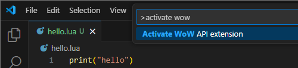
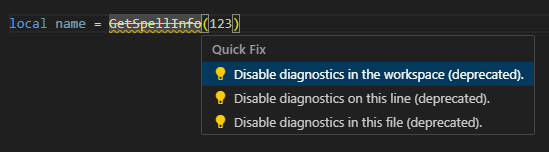

## WoW API for VS Code
[](https://opensource.org/licenses/MIT)
[](https://github.com/Ketho/vscode-wow-api/releases)
[](https://github.com/Gethe/wow-ui-source/tree/11.0.2)

Adds IntelliSense features for World of Warcraft API to VS Code. This is a third party extension for [LuaLS](https://marketplace.visualstudio.com/items?itemName=sumneko.lua) with [annotations](https://luals.github.io/wiki/annotations/).

### Activation
> [!IMPORTANT]  
> This extension will only activate when either:
> - A proper [.toc](https://warcraft.wiki.gg/wiki/TOC_format) file exists when the workspace is opened.
> - The extension was previously loaded in the workspace.
> - The "Activate WoW API extension" command is used.



### Features
#### API
* Includes the WoW Lua 5.1 environment
* Loads the official Blizzard [API documentation](https://github.com/Gethe/wow-ui-source/tree/live/Interface/AddOns/Blizzard_APIDocumentationGenerated)
* Parses [Warcraft Wiki](https://warcraft.wiki.gg/wiki/World_of_Warcraft_API) API documentation


#### [Widgets](https://warcraft.wiki.gg/wiki/Widget_API)


#### [Events](https://warcraft.wiki.gg/wiki/Events)


#### [CVars](https://warcraft.wiki.gg/wiki/Console_variables)


#### [Enums](https://github.com/Ketho/BlizzardInterfaceResources/blob/mainline/Resources/LuaEnum.lua)
* `Enum` and `Constants` table
* `LE_` Lua Enums


#### [GlobalStrings](https://github.com/Ketho/BlizzardInterfaceResources/blob/mainline/Resources/GlobalStrings.lua)
Shows completion for GlobalStrings at >3 uppercase letters to declutter fuzzy search.


## AddOn namespace
The [AddOn namespace](https://warcraft.wiki.gg/wiki/Using_the_AddOn_namespace) needs to be annotated with [@class](https://luals.github.io/wiki/annotations/#class) in each file. This way the language server knows about the shared table and also allows you to mutate it.

- `file1.lua`
```lua
---@class ns
local ns = select(2, ...)

ns.foo = "hello"
```

- `file2.lua`
```lua
---@class ns
local ns = select(2, ...)

ns.bar = "world"
```


## Deprecated API
If you intend to use deprecated APIs for Classic, the warning and strikethrough can be removed by disabling its diagnostic.



### Documentation
More documentation is available on the [project wiki](https://github.com/Ketho/vscode-wow-api/wiki).

## Contributing
The extension *reflects* the state of the wiki, so if you create/update the wiki pages, it will be updated in the extension on the next release. Otherwise feel free to create an [issue](https://github.com/Ketho/vscode-wow-api/issues) with the false errors.

For example [UnitLevel](https://warcraft.wiki.gg/wiki/API_UnitLevel) would be documented like so.
```lua
{{wowapi}}
Returns the level of the unit.
 level = UnitLevel(unit)

==Arguments==
:;unit:{{apitype|string}} : [[UnitToken]]

==Returns==
:;level:{{apitype|number}}
```

Alternatively, the script will look for a commented block for API pages not documented in [Blizzard_APIDocumentationGenerated](https://github.com/Gethe/wow-ui-source/tree/live/Interface/AddOns/Blizzard_APIDocumentationGenerated).
```lua
<!-- luals
---@param unit UnitToken
---@return number level
function UnitLevel(unit) end
-->
```

### Developing
- Linux: Refer to [SETUP.md](SETUP.md) if you want to run the Lua scripts which generate the documentation.
- Windows: I personally use LuaRocks on Windows but I like to shoot myself in the foot too. I should change this to use GitHub Actions or dev containers I suppose.
  - https://ketho.github.io/2024/07/04/luarocks-on-windows/

## Acknowledgements
- [Blizzard Entertainment](https://www.blizzard.com/)
- [Townlong Yak](https://www.townlong-yak.com/) - [Foxlit](https://www.townlong-yak.com/)
- [Wago Tools](https://wago.tools/) - [QartemisT](https://github.com/QartemisT)
- [Warcraft Wiki](https://warcraft.wiki.gg/) - [Kaydeethree](https://github.com/kaydeethree)
- [WoWInterface](https://wowinterface.com/)
- [Wowprogramming](https://wowprogramming.com/) - [jnwhiteh](https://twitter.com/jnwhiteh)
- [WoW.tools](https://wow.tools/) - [Marlamin](https://github.com/Marlamin)  
&nbsp;
- **Annotations**: [Kozoaku](https://github.com/Kozoaku), [Oppzippy](https://github.com/Oppzippy), [Snakybo](https://github.com/Snakybo), [Torhal](https://github.com/Torhal), [Wutname](https://github.com/Wutname1)
- **FrameXML**: [funkydude](https://github.com/funkydude), [Gethe](https://github.com/Gethe), [Tekkub](https://github.com/tekkub)
- **LuaLS**: [Sumneko](https://github.com/Sumneko)
- **VS Code extension**: [ChrisKader](https://github.com/ChrisKader), [DakJaniels](https://github.com/DakJaniels), [thatnerdjosh](https://github.com/thatnerdjosh), [Yuyuli](https://www.curseforge.com/members/yuyuli)
- **Wiki**: [DahkCeles](https://www.curseforge.com/members/dahkceles/projects), [Foxlit](https://www.townlong-yak.com/), [Iriel](https://warcraft.wiki.gg/wiki/Iriel), [Xelnath](https://warcraft.wiki.gg/wiki/Alexander_Brazie)  
&nbsp;
- **Algalon**: [Ghost](https://github.com/Ghostopheles)
- **Amazing people**: [Andols](https://www.curseforge.com/members/andols/projects), [Cidan](https://github.com/Cidan), [Ferronn](https://github.com/ferronn-dev), [Meorawr](https://github.com/Meorawr), [Nevcairiel](https://github.com/Nevcairiel)
- **BlizzardInterfaceResources**: [Resike](https://github.com/Resike)
- **DeadlyBossMods**: [Tandanu](https://github.com/emmericp), [MysticalOS](https://github.com/MysticalOS)
- **IntelliJ-IDEA-Lua-IDE-WoW-API**: [Ellypse](https://github.com/Ellypse)
- **WeakAuras**: [Buds](https://github.com/mrbuds), [Stanzilla](https://github.com/Stanzilla)
