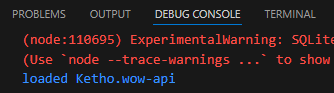
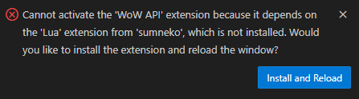

# Development Environment
> [!IMPORTANT]  
> This readme is for if you want to generate the LuaLS annotations yourself and/or contribute with development.

This project has only been tested with [WSL](https://code.visualstudio.com/docs/remote/wsl) (Ubuntu 24.04) and developed with the remote [WSL extension](https://marketplace.visualstudio.com/items?itemName=ms-vscode-remote.remote-wsl).
```sh
wsl --install
```

## Lua
- The [setup_lua.sh](setup_lua.sh) script installs Lua 5.4 and LuaRocks via [hererocks](https://github.com/luarocks/hererocks) which is self-contained.
- The module dependencies are in the [rockspec](https://github.com/Ketho/vscode-wow-api/blob/master/vscode-wow-api-scm-0.rockspec).
```sh
# wherever you want to clone the repo
cd ~
git clone https://github.com/Ketho/vscode-wow-api
cd vscode-wow-api

./setup_lua.sh
```

> [!NOTE]  
> Setting up LuaRocks on Windows is *strongly* discouraged but it may work with a lot of [headaches](https://ketho.github.io/2024/07/04/luarocks-on-windows/).

### Usage
Generates the LuaLS [annotations](Annotations). This is also available as the [Lua run](https://github.com/Ketho/vscode-wow-api/blob/master/.vscode/tasks.json#L19-L28) VS Code task.
```sh
# wherever the repo is
cd ~/vscode-wow-api

source .lua/bin/activate
lua luasrc/init.lua
```

## VS Code Extension
The [setup_npm.sh](setup_npm.sh) script installs the npm packages for TypeScript definitions and ESLint.
```sh
./setup_npm.sh
```

### Debugging
To debug the extension, pressing `F5` (which runs the default [build task](https://github.com/Ketho/vscode-wow-api/blob/master/.vscode/tasks.json#L7-L17)) and then opening a folder and looking at a Lua file should activate the extension.



> [!NOTE]  
> The extension will only fully load and setup the LuaLS configuration, if there is a valid .TOC file in the opened folder or if the "Activate WoW API extension" command is used.

> [!WARNING]
> You will probably get a notification first asking to install the Lua Language Server as a remote extension on WSL.



### Packaging
If you want to package the extension locally into a `.vsix` file.
```sh
npx vsce package
```
> [!NOTE]  
> The [package.json](package.json) already includes [vsce](https://code.visualstudio.com/api/working-with-extensions/publishing-extension) as a dev dependency so you won't need to install it first.
